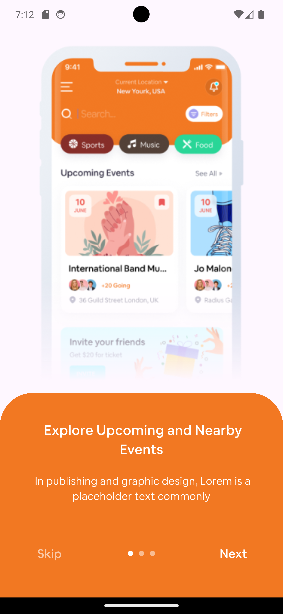
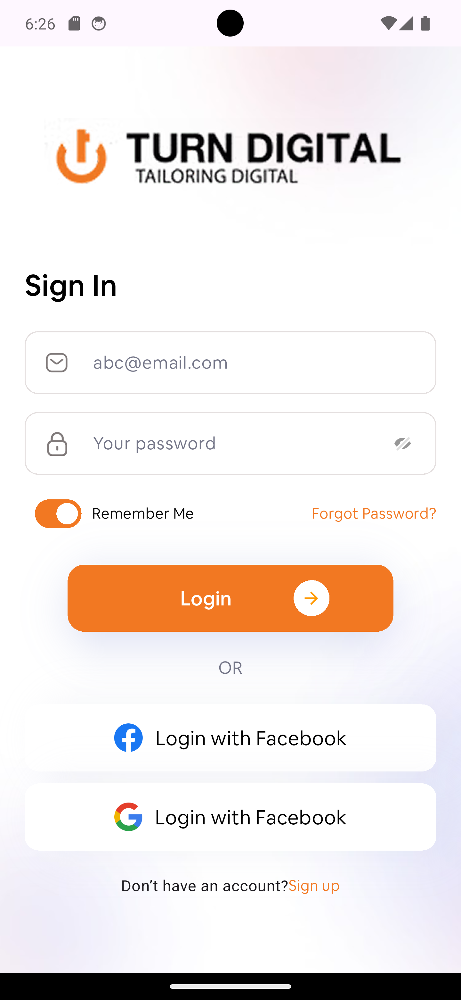
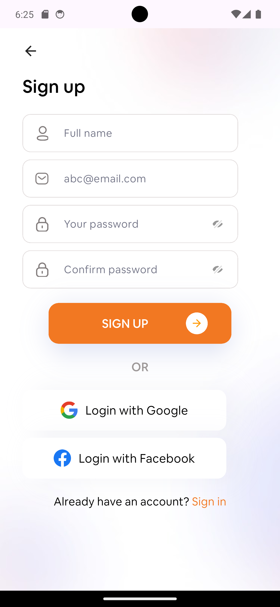
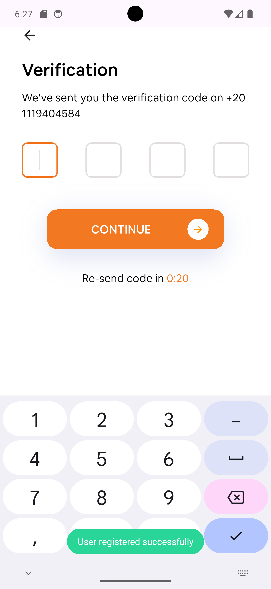
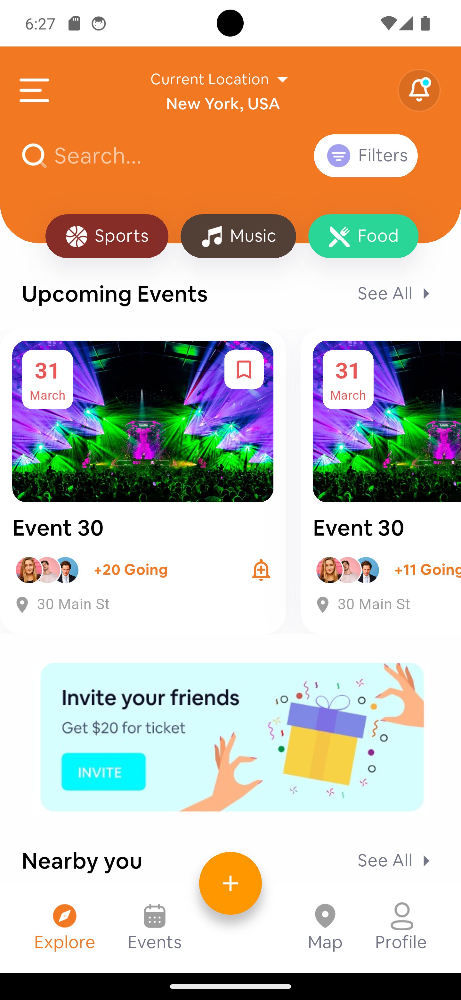
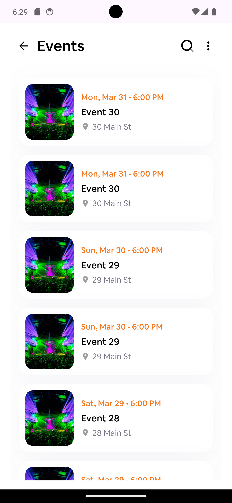
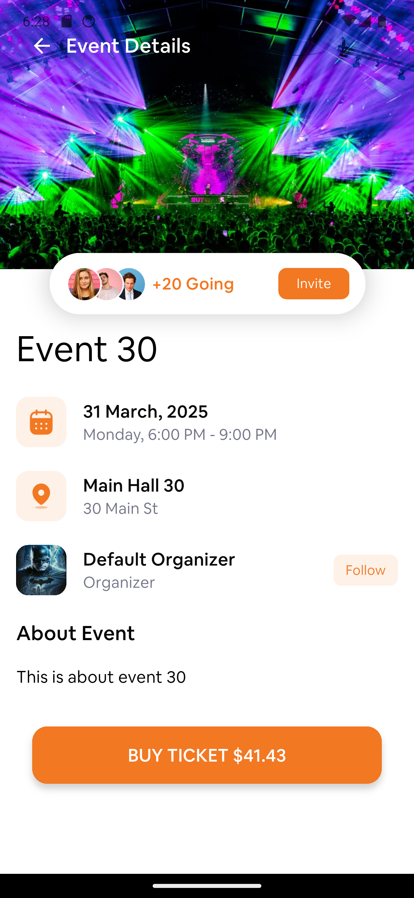
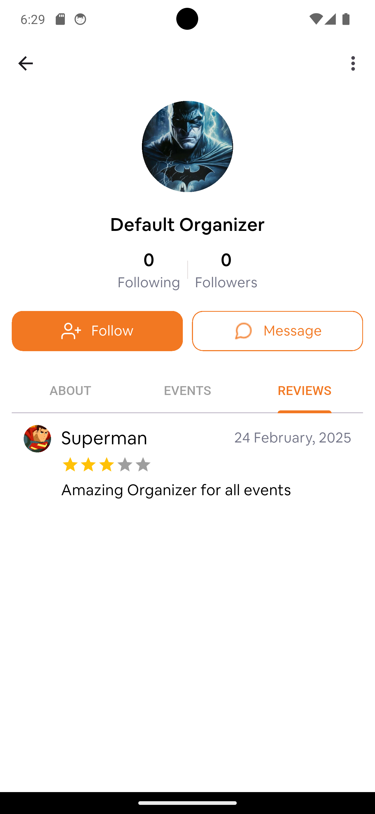
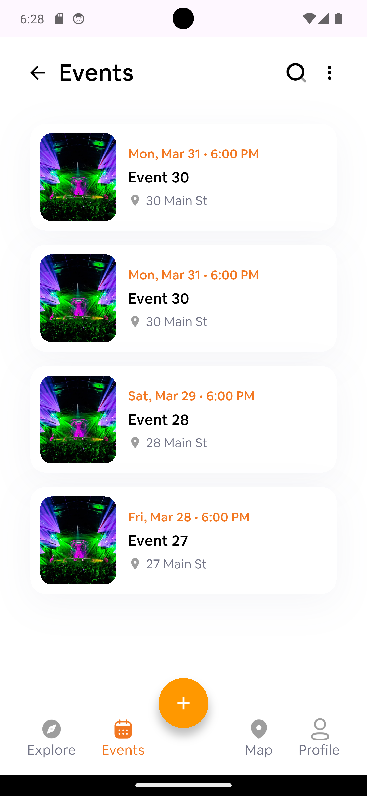

# Events Booking Application - Flutter

## Table of Contents
1. [Overview](#overview)
2. [Features](#features)
3. [Screenshots](#screenshots)
4. [Video Demo](#video-demo)
5. [Technical Details](#technical-details)
   - [API Integration](#api-integration)
   - [Error Handling](#error-handling)
   - [State Management](#state-management)
   - [Architecture](#architecture)
   - [Local Notifications](#local-notifications)
   - [Local Database](#local-database)
   - [Sharing Events](#sharing-events)
   - [Unit Testing](#unit-testing)
6. [Installation](#installation)
7. [Dependencies](#dependencies)

---

## Overview

This is a Flutter-based Events Booking Application that allows users to explore, book, and save events. The app includes features like user authentication, event browsing, event details, organizer profiles, and local event saving. The application is built using the **MVVM architecture** and leverages **Cubit** for state management.

---

## Features

- **User Authentication**: Login, Register, and OTP verification.
- **Home Screen**: Displays upcoming events and nearby events.
- **All Events Screen**: Lists all available events with pagination and lazy loading.
- **Event Details Screen**: Shows detailed information about a selected event.
- **Organizer Details Screen**: Displays organizer profiles, their events, and reviews.
- **Local Event Saving**: Users can save events locally using **Hive**.
- **Local Notifications**: Users receive notifications 1 hour before the event using **Flutter Local Notifications**.
- **Social Sharing**: Users can share event details (image, name, and location) using **Share_Plus**.
- **Unit Testing**: Comprehensive unit tests to ensure code reliability and maintainability.

---

## Screenshots

Below are the screenshots of the application:

| Screenshot 1 | Screenshot 2 |
|--------------|--------------|
|  |  |
|  |  |
|  |  |
|  |  |
|  |  |

---

## Video Demo

You can view the video demo of the application below:

[Video Demo](assets/turn_digital_demo.mp4)

---

## Technical Details

### API Integration
- **Dio** and **Retrofit** were used for API integration.
- **Pagination** and **Lazy Loading** were implemented to load events efficiently.
- API Endpoints:
  - Register: `http://api.td-dev.turndigital.net/api/users/register`
  - Events List: `http://api.td-dev.turndigital.net/api/events?page={PageNumber}&limit={PageSize}`
  - Event Details: `http://api.td-dev.turndigital.net/api/events/{EventID}`
  - Organizer Details: `http://api.td-dev.turndigital.net/api/organizers/{OrganizerID}`

### Error Handling
- An **API Error Model** was created to handle different error responses.
- **Error Handler Class** was implemented to check Dio exception types (e.g., connection timeout, server errors) and display meaningful error messages to the user.
- **Dio Interceptors** were used for logging API requests and responses to the console.

### State Management
- **Cubit** was used for state management, ensuring a clean and reactive UI.
- Cubit was chosen for its simplicity and ease of integration with the MVVM architecture.

### Architecture
- The application follows the **MVVM (Model-View-ViewModel)** architecture.
- The architecture ensures separation of concerns, making the codebase maintainable and scalable.

### Local Notifications
- **Flutter Local Notifications** plugin was used to schedule notifications.
- Users receive a notification **1 hour before the event**.

### Local Database
- **Hive** was used as the local database to save events locally.
- Users can access saved events from the "Events" tab in the bottom navigation bar.

### Sharing Events
- **Share_Plus** plugin was used to allow users to share event details (image, name, and location) on social media platforms.
- Sharing is triggered by long-pressing on the event card or in the event details screen.

### Unit Testing
- **Unit tests** were written to ensure the reliability and maintainability of the codebase.
- Tests cover critical parts of the application, including:
  - **API service** integration and error handling.
- Testing frameworks used:
  - **flutter_test**: For writing and running unit tests.
  - **mockito**: For mocking dependencies like API services and local databases.

---

## Installation

1. Clone the repository:
   ```bash
   git clone https://github.com/AyaNady17/Turn_Digital.git
   ```
2. Navigate to the project directory:
   ```bash
   cd Turn_Digital
   ```
3. Install dependencies:
   ```bash
   flutter pub get
   ```
4. Run the application:
   ```bash
   flutter run
   ```

---

## Dependencies

The following dependencies were used in this project:

- **Dio**: For API requests.
- **Retrofit**: For API service generation.
- **Cubit**: For state management.
- **Hive**: For local database.
- **Flutter Local Notifications**: For local notifications.
- **Share_Plus**: For sharing event details.
